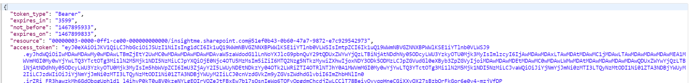

# SharePoint-apponly-node
access SharePoint using client credentials "apponly" from nodejs applications
 <code>run npm install sharepoint-apponly-node --save</code> 

1. Require the sharepoint-apponly module 
 
<code>
var sharepoint=require('sharepoint-apponly-node');
</code>
2. Execute call to getSharePointAppOnlyAccessToken and get the token response body in the callback
<code>
sharepoint.getSharePointAppOnlyAccessToken('https://yoursubdomain.sharepoint.com','YourClientId','YourClientSecret',function(response){
    console.log(response);
});
</code>
 
the result will be something like 
